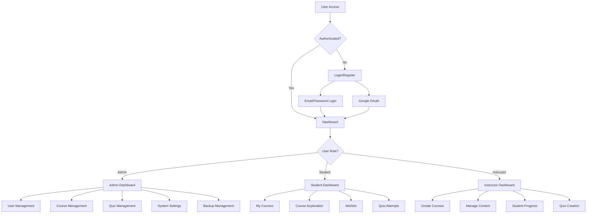
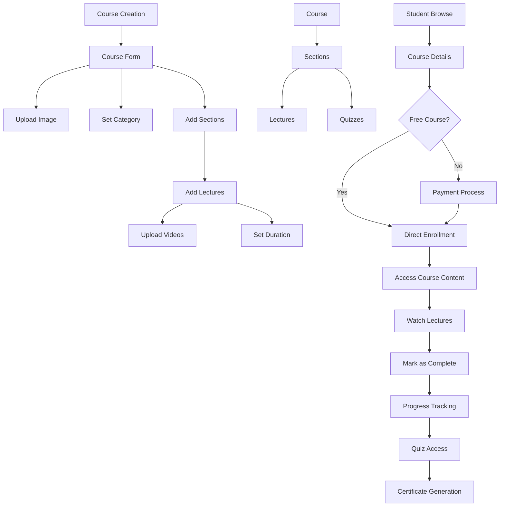
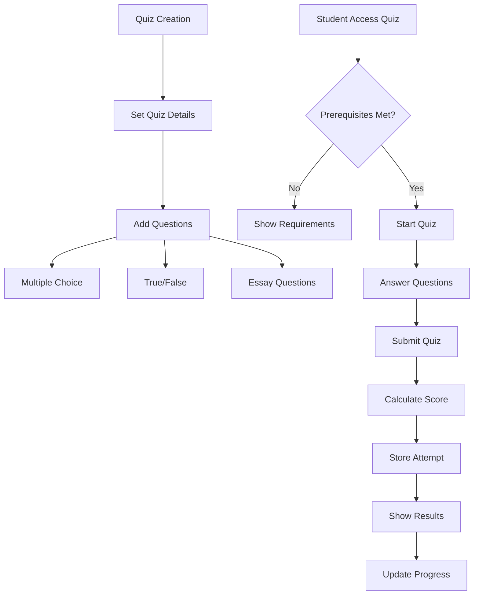
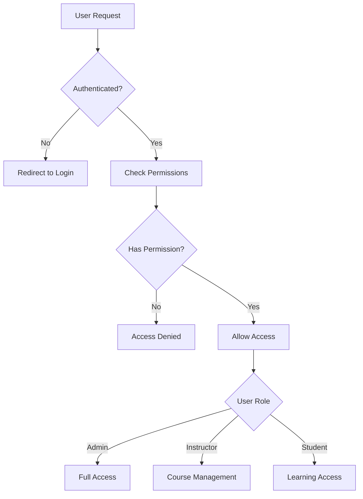
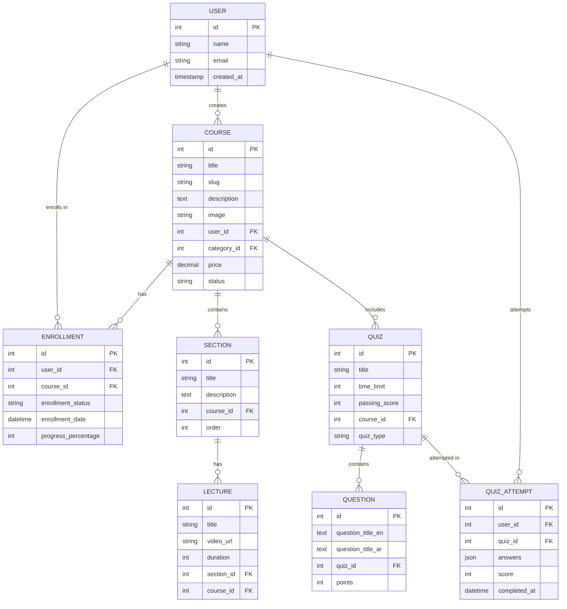
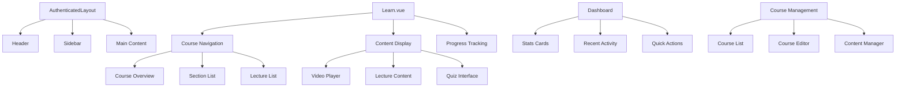
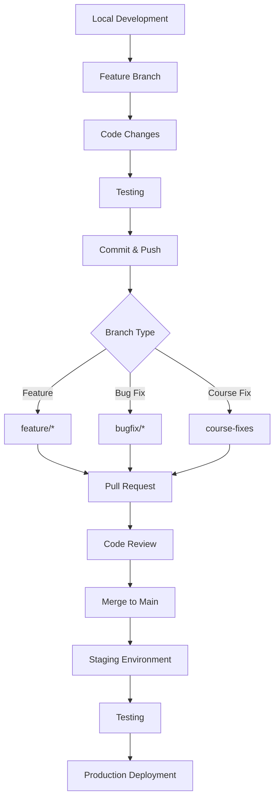
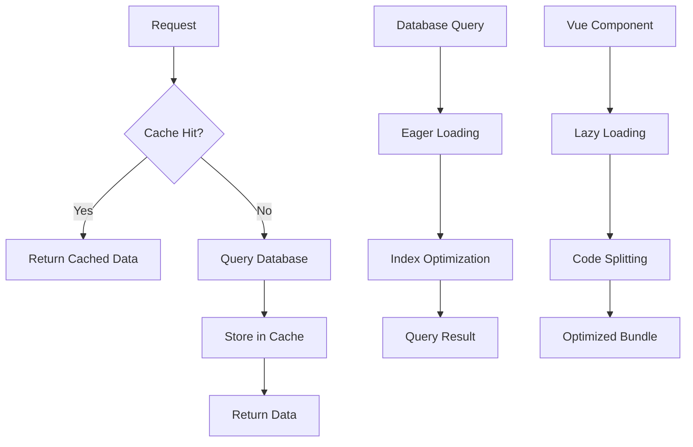

# Laravel Brive Project Flowchart

## 🏗️ Project Architecture Overview



## 📚 Course Management Flow



## 🧩 Quiz System Flow



## 🔐 Authentication & Authorization Flow



## 🗄️ Database Relationships



## 🎨 Frontend Component Structure



## 🔄 API Endpoints Flow

```mermaid
graph LR
    %% Public Routes
    A[Public Routes] --> A1[/]
    A --> A2[/courses/explore]
    A --> A3[/auth/google]
    
    %% Protected Routes
    B[Protected Routes] --> B1[/dashboard]
    B --> B2[/courses/*]
    B --> B3[/my-courses]
    B --> B4[/profile]
    
    %% Admin Routes
    C[Admin Routes] --> C1[/user/*]
    C --> C2[/role/*]
    C --> C3[/permission/*]
    C --> C4[/courses/create]
    
    %% Course Routes
    D[Course Routes] --> D1[GET /courses/{id}/details]
    D --> D2[POST /courses/{id}/enroll]
    D --> D3[GET /courses/{id}/learn]
    D --> D4[GET /courses/{id}/player]
```

## 🚀 Deployment & Git Workflow



## 📊 Performance Optimization Flow



## 🔧 Key Features Summary

### Core Functionality
- **User Management**: Registration, authentication, role-based access
- **Course Management**: Creation, editing, content organization
- **Learning System**: Video playback, progress tracking, completion
- **Quiz System**: Multiple question types, scoring, attempts tracking
- **Enrollment System**: Course enrollment, wishlist, recommendations

### Technical Stack
- **Backend**: Laravel 10, PHP 8.1+
- **Frontend**: Vue.js 3, Inertia.js, Tailwind CSS
- **Database**: MySQL/PostgreSQL
- **Authentication**: Laravel Sanctum, Google OAuth
- **File Storage**: Laravel Storage (local/cloud)
- **Caching**: Redis/Memcached

### Security Features
- Role-based permissions (Spatie)
- CSRF protection
- Input validation
- SQL injection prevention
- XSS protection

---

*This flowchart represents the current state of the Laravel Brive project as of the latest commit on the `course-fixes` branch.*